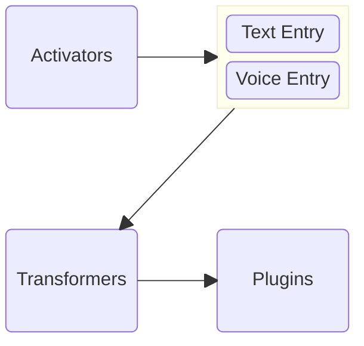

## Your voice, your rules

#### 100% Offline & Private.

Vocode is the fastest and easiest way to record your voice and seamlessly export transcriptions into your notes and automations—all while keeping your data completely **offline, secure, and private**. Your recordings and transcriptions **never leave your device**, ensuring absolute confidentiality. 

Whether you're capturing ideas on the go, dictating tasks, or enhancing your workflow, Vocode empowers you with intuitive voice recording and powerful transcription features.

## 🚀 Key Features

### [🎙](activators) Activators
Activators let you start a recording quickly and intuitively. Whether you're in the app or using a system-wide shortcut, recording your voice has never been easier.

- **In-App Button** – Start and stop recording with a simple tap.
- **Volume Button Combination** – Press both volume buttons at once for a push-to-talk style recording. The recording stops automatically when you release the buttons.
- **And more...**

**We’re especially proud of the volume button combo, making hands-free recording effortless and natural!**

### [🔧](transformers/) Transformers
Transform your transcriptions with powerful built-in tools:
- Convert text to **uppercase** or **lowercase**.
- **Remove punctuation** for cleaner results.
- **Macros** to find & replace text.
- **And more...**

### 🔌 Plugins
Extend Vocode’s functionality with core and community-developed plugins:
- [**Core Plugins**](plugins/core_plugins/) – Developed by us to enhance your experience.
- **Community Plugins** – Create and share plugins using our [**Lua API**](developers/lua_apis/), available to all developers for free.
  - Check out the community plugins on [GitHub](https://github.com/ViscousPot/vocode-community).

### 💾 Backup & Restore
Keep your transcriptions safe with **secure local backup and restore options**—no cloud required.

## 🆓 Free vs. Pro
| Feature          | Free Version  | Pro Version  |
|------------------|---------------|--------------|
| **Activators**   | ✅ All        | ✅ All       |
| **Transformers** | ❌ None       | ✅ All       |
| **Plugins**      | ✅ 1 only     | ✅ All       |

Upgrade to **Vocode Pro** to unlock the full potential of voice recording and transcription automation—while staying 100% offline and private!

---

Ready to get started? Explore the documentation to learn more about Vocode’s features and how to make the most of them! 🚀